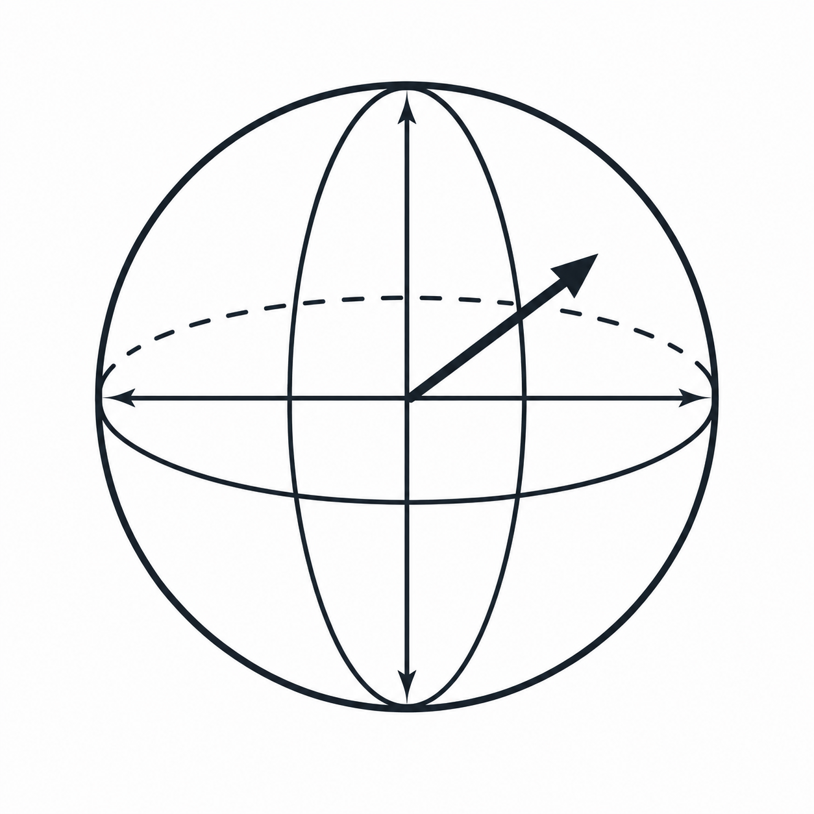

<p align="center">
  
</p>

<p style="text-align: center;"># Phasor Workbench</p>

[](https://github.com/zpparks314/phasor-workbench/actions/workflows/ci.yml)
[](LICENSE)

An open-source, browser-based workbench for building, visualizing, simulating, and **understanding** quantum circuits.

Built by Zachary Parks ([RogueScholar](https://github.com/zpparks314)).

> **On the name:** a *phasor* is a rotating complex number carrying magnitude
> and phase — which is exactly what a quantum amplitude is. The name describes
> what the tool makes visible.

> **Project status: building the circuit model.**
> The foundation is complete and the shared circuit schema now exists, but no
> quantum features are usable yet. There is no circuit editor, no validation,
> and no simulation. See [Current Status](#current-status).

---

## What It Is

Most quantum software optimizes for execution — a circuit goes in, a result comes out, and everything in between is invisible.

Phasor Workbench treats the part in between as the interesting part.

The goal is a tool where you can build a circuit, run it, and then see *why* it produced the result it did: state inspection, amplitude and probability displays, Bloch spheres, and annotated algorithm walkthroughs.

It sits deliberately between educational toys that can't express real circuits and professional frameworks that assume you already know the mathematics.

**Planned capabilities**

* visual circuit editor with drag-and-drop gate placement
* statevector and sampling simulation
* live circuit analysis — gate counts, depth, breakdown
* educational visualizations of quantum state
* OpenQASM and JSON import/export
* a library of explorable standard algorithms

**Explicit non-goals:** real hardware execution, AI circuit generation, and accounts-first design. See [Vision.md](docs/Vision.md).

---

## Current Status

**Milestone 1 — Foundation: complete.** **Milestone 2 — Circuit Model: in progress.** The foundation was deliberately finished before any quantum features were built.

| Area | State |
|---|---|
| Documentation | Written; `UI.md` deferred to Milestone 3 |
| Backend project | Verified — installs, tests pass, lint and types clean |
| Frontend project | Verified — installs, builds, tests pass, lint and types clean |
| Frontend ↔ backend | Verified — connects through the dev proxy, degrades gracefully when the backend is down |
| Circuit model design | Settled — ADRs 0001–0004 accepted |
| Circuit schema | Done — `shared/schema/`, the single source of truth for the wire format |
| Generated bindings | Done — Pydantic models and TypeScript types, generated into both projects |
| Circuit validation | **Not started** |
| Cycle derivation | **Not started** |
| Contract fixtures | **Not started** |
| Tooling and tests | Configured and passing for both projects |
| CI | Lint, format, type check, test, build, and generated-binding freshness on every push and PR |
| Branch protection | `main` requires a PR and a passing `CI` check |
| Continuous deployment | Deferred to Milestone 5 — nothing to deploy yet |
| Docker environment | Both services, hot-reloading, Python 3.13 in-container |

Only `GET /api/v1/health` is implemented. A circuit can be *described* — the schema and its generated types exist on both sides — but nothing yet validates one, derives its cycles, or simulates it.

Design decisions behind the model are recorded as [ADRs](docs/decisions/): the circuit is a flat ordered operation list with cycles derived rather than stored, every object carries a stable client-generated identifier, and JSON Schema is the source of truth for the wire format.

Full plan: [Roadmap.md](docs/Roadmap.md).

---

## Repository Structure

```text
frontend/    React + TypeScript + Vite + Tailwind
backend/     Python + FastAPI + Pydantic
shared/      Circuit Model, schema, cross-language fixtures
tests/       Cross-cutting integration and contract tests
docs/        Project documentation
```

Rationale for the layout — especially why `shared/` and `tests/` are separate — is in [ProjectStructure.md](docs/ProjectStructure.md).

---

## Documentation

Documentation is treated as part of the project, not an afterthought. Start here:

| Document | Covers |
|---|---|
| [Vision.md](docs/Vision.md) | Why the project exists, who it's for, what's out of scope |
| [Architecture.md](docs/Architecture.md) | System structure, module boundaries, architectural rules |
| [ProjectStructure.md](docs/ProjectStructure.md) | Repository layout and the reasoning behind it |
| [Roadmap.md](docs/Roadmap.md) | Milestones, current objectives, definition of done |
| [CircuitModel.md](docs/CircuitModel.md) | The circuit data model — the single source of truth |
| [API.md](docs/API.md) | REST contract between frontend and backend |
| [Simulation.md](docs/Simulation.md) | Simulation pipeline, backends, limits, correctness testing |
| [Frontend.md](docs/Frontend.md) | Frontend stack, rendering decision, API client |
| [UI.md](docs/UI.md) | *Deferred — belongs with Milestone 3* |
| [decisions/](docs/decisions/) | Architecture Decision Records — why the model is shaped the way it is |

`CircuitModel.md` is **accepted and partially implemented**: its types exist as generated bindings, but validation and the cycle derivation do not.

`API.md` and `Simulation.md` remain **drafts pending review**. They describe intended design, not implemented behavior.

---

## Architecture at a Glance

```text
Frontend  →  Shared Circuit Model  →  Backend Services  →  Simulation Engine
```

The Circuit Model is the center. Every subsystem — editor, simulator, importers, exporters, visualizations — reads from and writes to the same representation.

Rules that rarely bend:

* the frontend does not simulate circuits
* the backend does not render UI
* the Circuit Model is the single source of truth
* APIs define module boundaries
* every feature is independently testable

Details and rationale: [Architecture.md](docs/Architecture.md).

---

## Getting Started

Two supported paths. **Docker** is the fastest way to get running; **native** is what CI runs. Neither is more official than the other.

### Docker

Requires Docker Desktop or Docker Engine with Compose v2.

```bash
docker compose up --build
```

Frontend on `http://localhost:5173`, backend on `http://localhost:8000`. Both hot-reload from your working tree — source is bind-mounted, not baked in.

The container pins **Python 3.13** rather than the 3.14 used natively, because Qiskit publishes no 3.14 wheels. That makes the container where the Milestone 4 `simulation` extra will install.

Production images are deliberately **not** included; they belong with Deployment in Milestone 5. Both Dockerfiles are already multi-stage, so adding a `production` target is additive.

### Native — Prerequisites

* **Python 3.11+** — the backend runs on 3.14
* **Node 20.19+** — required for the frontend

### Backend

```bash
cd backend
python -m venv .venv
.venv\Scripts\activate          # Windows
# source .venv/bin/activate     # macOS / Linux

pip install -e ".[dev]"
uvicorn phasor_workbench.main:app --reload --port 8000
```

Verify: `http://localhost:8000/api/v1/health` returns `{"status":"ok","version":"0.1.0"}`
Interactive API docs: `http://localhost:8000/api/v1/docs`

Qiskit and NumPy are in an optional `simulation` extra, since nothing before Milestone 4 uses them. Note that Qiskit does not yet publish Python 3.14 wheels, so that extra currently needs 3.11–3.13:

```bash
pip install -e ".[dev,simulation]"
```

### Frontend

```bash
cd frontend
npm install
npm run dev
```

Runs on `http://localhost:5173` and proxies `/api` to the backend.

With both running, `http://localhost:5173` should report **Connected — API version 0.1.0**.

### Checks

```bash
# Backend
cd backend && pytest && ruff check . && ruff format --check . && mypy

# Frontend
cd frontend && npm test && npm run lint && npm run format:check && npm run typecheck

# Shared model -- fails if the generated bindings no longer match the schema
python shared/generate_bindings.py --check
```

The `--check` variants are what CI runs. The rewriting variants (`ruff format`,
`npm run format`) pass silently by fixing the problem, so a green local run
proves nothing about CI.

### Changing the circuit model

`shared/schema/circuit.schema.json` is the source of truth. After editing it:

```bash
python shared/generate_bindings.py
```

The schema and its regenerated bindings belong in the same commit; CI rejects
the pair when they drift. Generated files are never edited by hand — see
[ADR-0004](docs/decisions/ADR0004_SharedModelStrategy.md).

---

## Contributing

The project is in its foundation phase, and the architecture is still settling. Contributions are welcome, but please read [Architecture.md](docs/Architecture.md) and [Roadmap.md](docs/Roadmap.md) first.

Working principles:

* complete the current milestone before starting the next
* finish features rather than leaving partial implementations
* write tests for new functionality
* update documentation alongside code
* keep commits focused on a single logical change

If a change would alter the architecture, open a discussion before implementing it.

A feature is done only when it works, tests pass, docs are updated, linting and type checking pass, the code has been reviewed, and the application remains deployable.

---

## License

Licensed under the **[Apache License 2.0](LICENSE)**. Copyright 2026 Zachary Parks.

Apache 2.0 rather than MIT for a reason specific to this field: quantum computing is heavily patented, and this project plans implementations of published algorithms. Apache 2.0 §3 grants an explicit patent license from contributors — with a retaliation clause — where MIT is silent on patents entirely. It also matches Qiskit, Cirq, and Q#, which removes compatibility friction with the ecosystem this project depends on.

Contributions are accepted under the same license, per Apache 2.0 §5.
